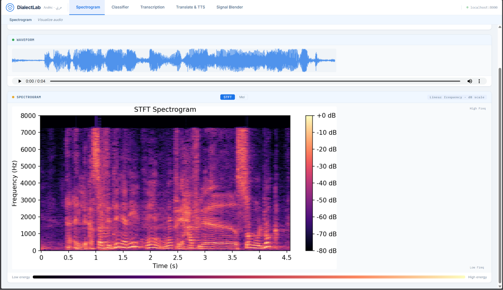
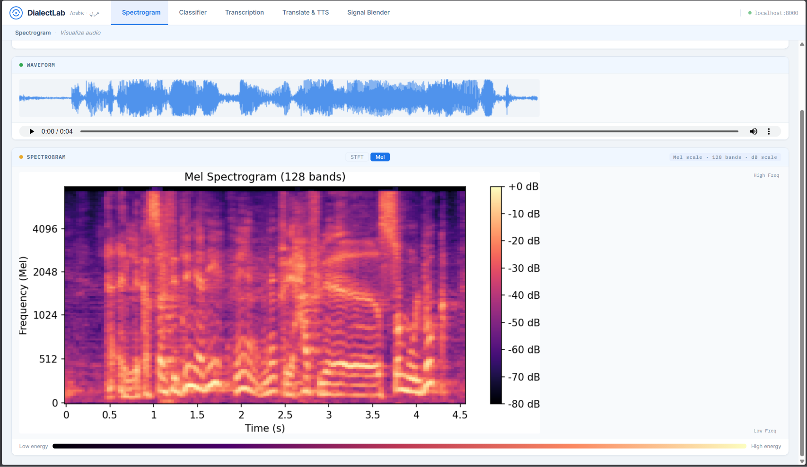
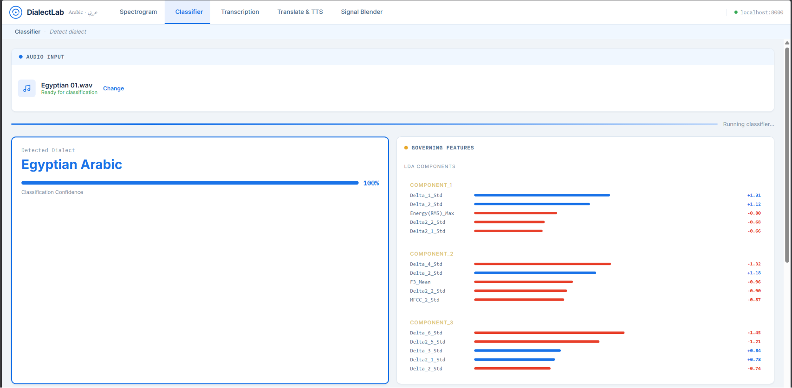
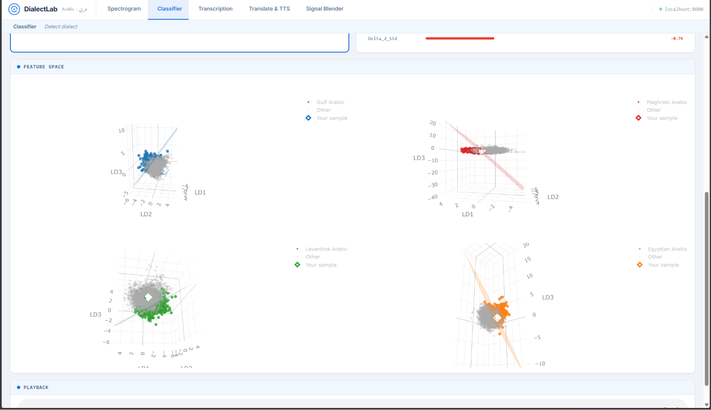

# Arabic Dialect Fingerprint

A web application for Arabic dialect detection, real-time transcription, cross-dialect translation, and audio blending — all powered by classical ML and state-of-the-art pretrained models.

---

## 📋 Table of Contents

- [Overview](#overview)
- [Features](#features)
- [System Architecture](#system-architecture)
- [Installation](#installation)
- [Usage](#usage)
- [Technical Details](#technical-details)
- [Dataset](#dataset)
- [Results](#results)
- [Dependencies](#dependencies)

---

## Overview

This application explores the acoustic and linguistic fingerprints of Arabic dialects. It covers four major dialect families:

| Dialect | Region |
|---|---|
| Gulf Arabic (الخليجية) | Saudi Arabia, UAE, Kuwait, Qatar |
| Egyptian Arabic (المصرية) | Egypt |
| Levantine Arabic (الشامية) | Syria, Lebanon, Jordan, Palestine |
| Maghrebi Arabic (المغاربية) | Morocco, Algeria, Tunisia |

The system accepts ~30-second audio clips and performs dialect identification using **classical machine learning only** (no deep learning for classification). Transcription and dialect translation leverage external pretrained models via API.

---

## Features

### 1. 🌊 Spectrogram Visualization
Upload a voice file and instantly visualize its mel-spectrogram and waveform. The app ships with 16 pre-recorded samples: **4 dialects × 4 different speakers each**.




---

### 2. 🤖 Classical ML Dialect Identification
Dialect classification is performed using a **K-Nearest Neighbors (KNN)** classifier operating on a 102-dimensional hand-crafted feature vector. The decision process is fully explainable — no neural networks are involved.

**Displayed features include:**
- MFCC heatmaps per dialect showing spectral timbre differences
- Pitch (F0) contour overlaid on the spectrogram
- Formant trajectories (F1, F2, F3) showing vowel-space distinctions
- LDA 3D scatter plot showing inter-dialect separability (see visualization above)






---

### 3. 🎤 Real-Time Transcription
While the audio plays, the spoken words are transcribed and displayed in real time using **OpenAI Whisper Large v3** via the Hugging Face Transformers API, forced to Arabic transcription mode.

https://github.com/user-attachments/assets/54c754d8-36ea-42f3-adac-3cc93b2d69f4

---

### 4. 🔄 Cross-Dialect Translation
The user can select a **target dialect** and hear the same content re-spoken in that dialect — with both vocabulary and tone adapted. Translation is powered by **Fanar-1-9B-Instruct** (QCRI), an Arabic-specialized LLM, using a two-pass pipeline (translation + artifact cleaning).

Supported translation directions: Gulf ↔ Egyptian ↔ Levantine ↔ Maghrebi ↔ MSA (Modern Standard Arabic).

https://github.com/user-attachments/assets/1709090f-e768-495e-87cc-8f45a44dc3b6

---

### 5. 🎚️ Dialect Blending
Provide two audio files and use the slider to set a blending ratio (e.g., 70% File A / 30% File B). The blended audio is treated as a new file and passed through the classifier. The output is a **probability distribution** over dialects — expected to reflect the mixing ratio.

https://github.com/user-attachments/assets/74da17ac-48c7-4ac9-81ec-39468cc42b21

---

## System Architecture

```
┌──────────────────────────────────────────────────────────┐
│                     Web Application                      │
│  (FastAPI backend + frontend served via ngrok tunnel)    │
└───────────────┬──────────────────────────────────────────┘
                │
        ┌───────▼────────┐
        │  Audio Input   │  ← Upload .wav/.mp3 or use pre-loaded samples
        └───────┬────────┘
                │
   ┌────────────┼──────────────────────┐
   ▼            ▼                      ▼
Feature     Whisper                Fanar-1-9B
Extraction  Large v3               Instruct
(librosa)   (Transcription)        (Translation)
   │
   ▼
KNN Classifier
(sklearn Pipeline)
   │
   ▼
Dialect Label + Confidence + Feature Visualization
```

---

## Installation

### Prerequisites
- Python 3.9+
- CUDA-capable GPU (recommended; CPU mode is slow for Whisper)
- `pip` and `npm` (optional, for frontend build)

### Clone & Install

```bash
git clone https://github.com/YOUR_USERNAME/arabic-dialect-fingerprint.git
cd arabic-dialect-fingerprint
pip install -r requirements.txt
```

### Requirements

```
torch
transformers
librosa
scikit-learn
numpy
soundfile
fastapi
uvicorn
pyngrok
bitsandbytes   # for 4-bit quantization of Fanar
nest_asyncio
tqdm
```

---

## Usage

### Launch the API server

```python
import nest_asyncio
from pyngrok import ngrok
import uvicorn

nest_asyncio.apply()
public_url = ngrok.connect(8000)
print(f"Public URL: {public_url}")

uvicorn.run(app, host="0.0.0.0", port=8000)
```

### Endpoints

| Method | Endpoint | Description |
|---|---|---|
| `POST` | `/upload` | Upload audio, returns spectrogram + dialect prediction |
| `POST` | `/transcribe` | Stream real-time transcription of uploaded file |
| `POST` | `/translate` | Translate transcription to target dialect |
| `POST` | `/blend` | Blend two audio files with given weight and classify result |

---

## Technical Details

### Feature Extraction (102-dimensional vector)

All features are computed using `librosa` at 16 kHz with 25 ms frames and 10 ms hops.

| Feature Group | Dimensions | Description |
|---|---|---|
| MFCCs (mean) | 39 | 13 coefficients + Δ + ΔΔ |
| MFCCs (std) | 39 | Temporal variance of above |
| Prosodic | 12 | F0 (YIN), RMS energy, ZCR — each as [mean, std, min, max] |
| Formants F1/F2/F3 | 12 | LPC-estimated vocal tract resonances |
| **Total** | **102** | |

```python
# Feature extraction pipeline (simplified)
mfcc         = librosa.feature.mfcc(y=y, sr=sr, n_mfcc=13)
delta_mfcc   = librosa.feature.delta(mfcc)
delta2_mfcc  = librosa.feature.delta(mfcc, order=2)
f0           = librosa.yin(y, fmin=65, fmax=2093, sr=sr)
formants     = estimate_formants_lpc(frame, sr, lpc_order=10)
```

### Classifier

```python
pipeline = Pipeline([
    ('scaler', StandardScaler()),
    ('classifier', KNeighborsClassifier(
        n_neighbors=5,
        weights='distance',
        metric='euclidean',
        n_jobs=-1
    ))
])
```

Labels are encoded with `LabelEncoder` before training. Confidence scores are derived from the distance-weighted neighbor votes.

### Transcription — Whisper Large v3

```python
model_id = "openai/whisper-large-v3"
# Forced to Arabic transcription; runs in float16 on GPU
predicted_ids = model.generate(inputs, language="arabic", task="transcribe")
```

### Dialect Translation — Fanar-1-9B

The translation uses a two-pass approach to suppress LLM verbosity:

1. **Pass 1 — Translation:** Fanar translates the transcribed text to the target dialect using a strict system prompt.
2. **Pass 2 — Cleaning:** A second Fanar call strips any artifacts (quotes, labels, preambles) from the output.
3. **Post-processing:** The first non-empty line of the cleaned output is returned as the final translation.

The model is loaded in **4-bit NF4 quantization** (via BitsAndBytes) to fit in consumer GPU VRAM.

---

## Dataset

The application ships with 16 pre-recorded audio samples organized as:

```
data/
  gulf/
    speaker_1.wav
    speaker_2.wav
    speaker_3.wav
    speaker_4.wav
  egyptian/
    speaker_1.wav  ...
  levantine/
    speaker_1.wav  ...
  maghrebi/
    speaker_1.wav  ...
```

Each clip is approximately 30 seconds of natural conversational speech.

---

## Results

### KNN Classification Report (Test Set)

| Dialect | Precision | Recall | F1-Score | Support |
|---|---|---|---|---|
| Egyptian Arabic | 0.86 | 0.79 | 0.83 | 87 |
| Gulf Arabic | 0.81 | 0.80 | 0.80 | 88 |
| Levantine Arabic | 0.83 | 0.76 | 0.79 | 88 |
| Maghrebi Arabic | 0.82 | 0.97 | 0.89 | 88 |
| **Accuracy** | | | **0.83** | **351** |
| **Macro Avg** | 0.83 | 0.83 | 0.83 | 351 |
| **Weighted Avg** | 0.83 | 0.83 | 0.83 | 351 |

> Fill in after final evaluation run. Run `python evaluate.py` to regenerate.

### Key Observations

- **Gulf Arabic** forms the most distinct cluster in LDA space (tightest grouping, leftmost in LDA 1).
- **Maghrebi Arabic** is separated almost entirely along LDA 2, consistent with its heavy Berber and French substrate influences.
- **Levantine and Egyptian Arabic** overlap more in feature space, reflecting their shared Semitic phonology, but are reliably separated by F2 (second formant) statistics.
- The blending experiment shows classifier output probability shifts monotonically with the mixing slider, validating the feature-space linearity assumption.

---

## Dependencies

| Library | Version | Purpose |
|---|---|---|
| `torch` | ≥2.0 | GPU inference |
| `transformers` | ≥4.40 | Whisper + Fanar models |
| `librosa` | ≥0.10 | Audio feature extraction |
| `scikit-learn` | ≥1.4 | KNN classifier + LDA |
| `bitsandbytes` | ≥0.43 | 4-bit model quantization |
| `fastapi` | ≥0.110 | REST API server |
| `pyngrok` | any | Public tunnel for Colab |
| `soundfile` | any | Audio I/O |
| `numpy` | any | Numerical operations |

---

## License

This project was developed as an academic submission. All audio samples used are original recordings collected for this task.
